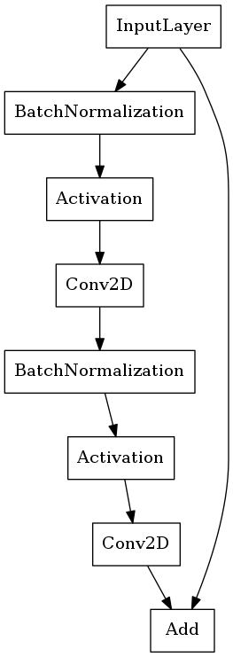
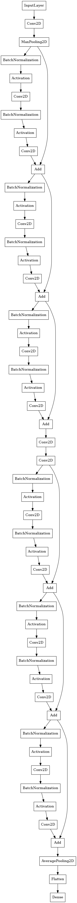
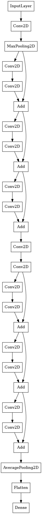

# ResNet-DenseNet-Notebook
[This Jupyter notebook](http://nbviewer.jupyter.org/github/ishengfang/ResNet-DenseNet-Notebook/blob/master/ResNet%26DenseNet.ipynb) is using keras to build the residual or dense block, and compare with four models in cifar100 classification as following.
- 18 layers **residual** network with *ReLU and batch normalization*
- 18 layers **plain** network with *ReLU and batch normalization*
- 18 layers **residual** network with *SELU*
- 18 layers **plain** network with *SELU*

All model was trained with 100 epochs and Adam(learning rate:$10^{-5}$)
## TL;DR
### Residual Block Plot

### Loss

### Accuracy

### Whole Model plot
#### Residual Network with ReLU and batch normalization 

#### Residual Network with SELU

