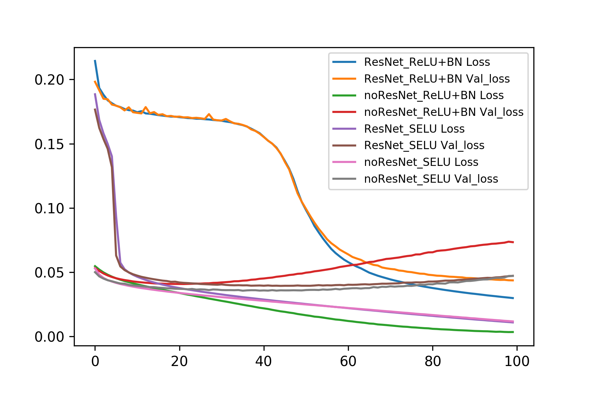
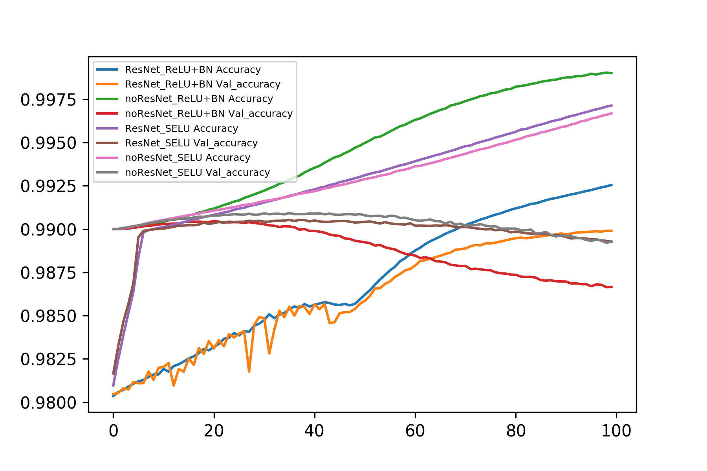

# ResNet-DenseNet-Notebook
This Jupyter notebook is using keras to build the residual or dense block, and compare with four models in cifar100 classification as following.
- 18 layers **residual** network with *ReLU and batch normalization*
- 18 layers **plain** network with *ReLU and batch normalization*
- 18 layers **residual** network with *SELU*
- 18 layers **plain** network with *SELU*

All model was trained with 100 epochs and Adam(learning rate:$10^{-5}$)
## TL;DR

